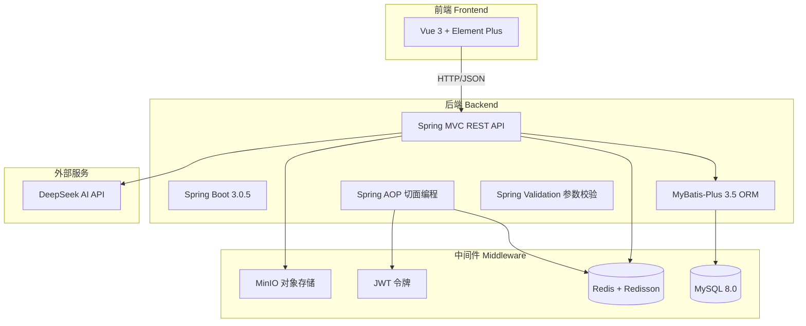
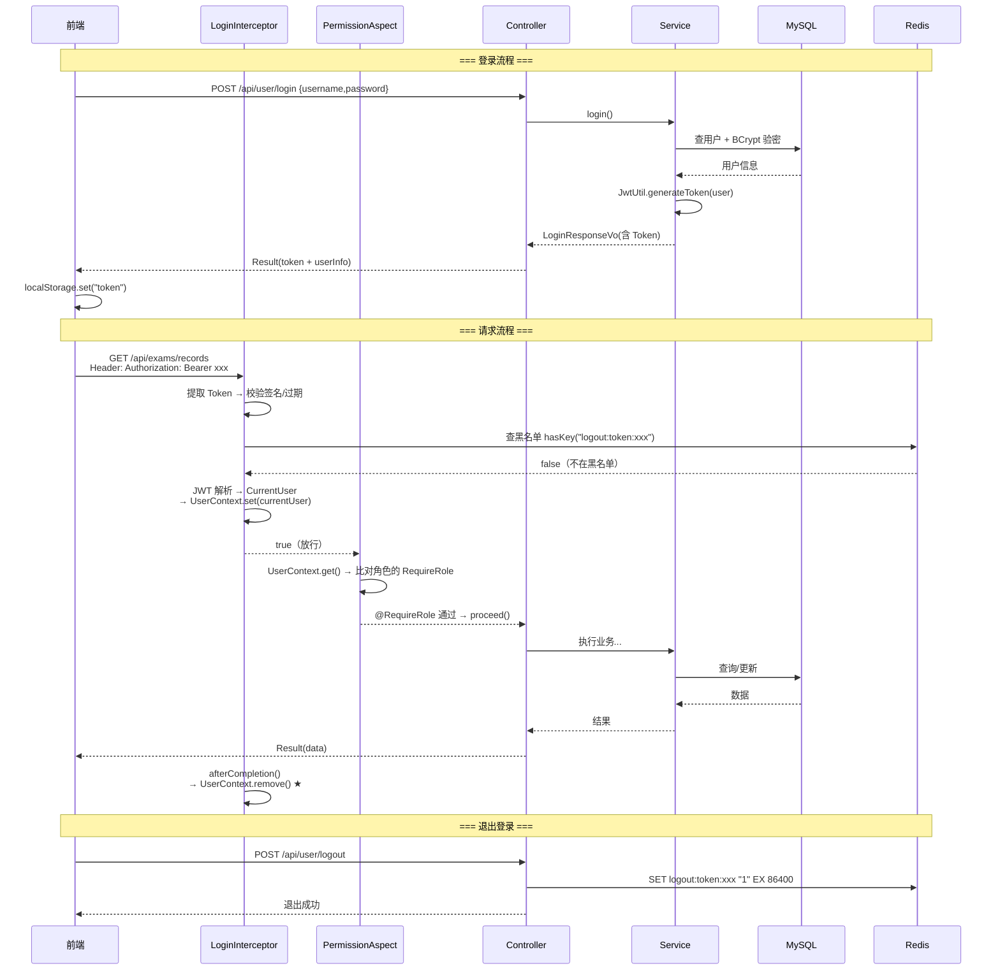
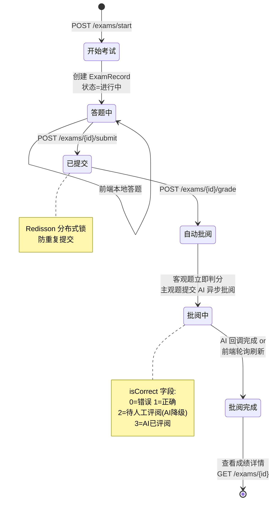
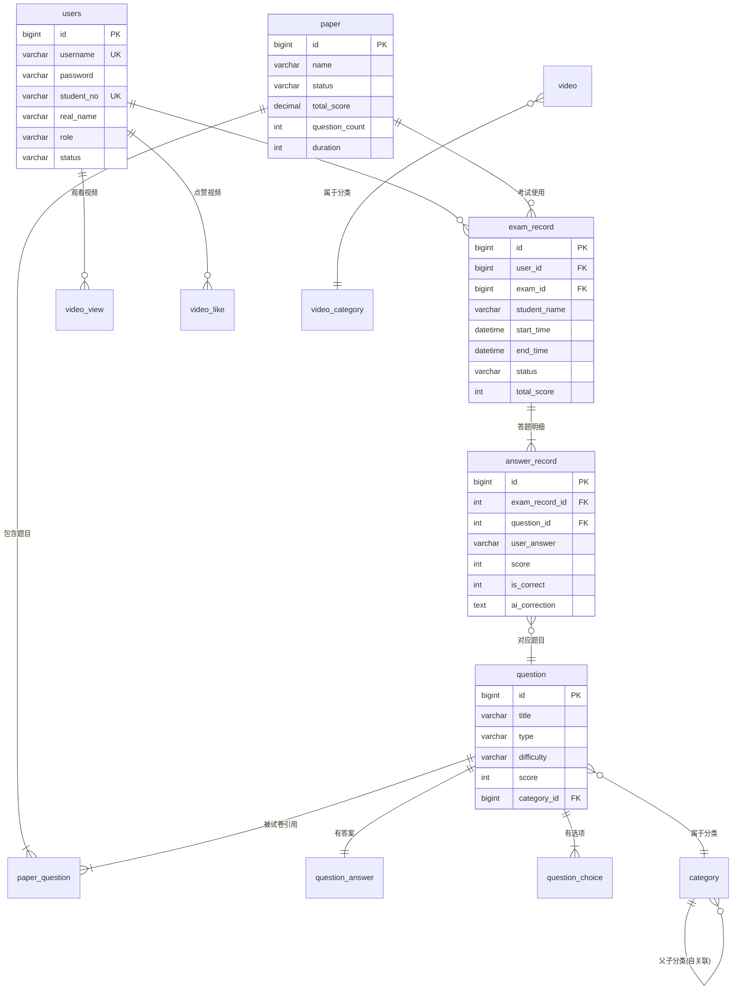
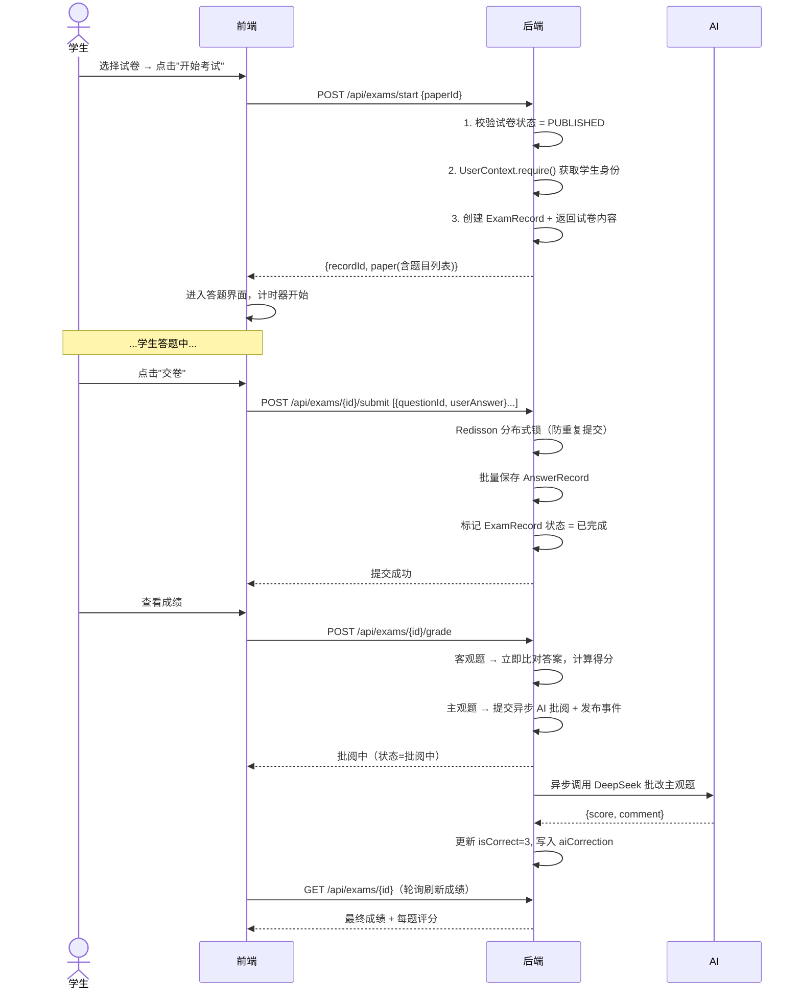

# 智能考试系统 (AI Exam System) — 项目完整架构分析

> **适用读者**：Java 后端初学者，正在学习 Spring Boot + MyBatis-Plus + Redis + JWT 技术栈。

---

## 一、项目概览

这是一个**前后端分离的智能在线考试平台**，包含以下核心能力：

| 维度 | 描述 |
|------|------|
| **定位** | 在线考试 + AI 辅助出题/批改的学习平台 |
| **后端** | Spring Boot 3.0.5 + MyBatis-Plus 3.5 + MySQL 8.0 |
| **前端** | Vue 3 + Element Plus + Axios（在 `exam-system-web-backup - 8081` 目录） |
| **身份认证** | JWT 无状态认证 + Redis 黑名单 |
| **权限控制** | 自定义注解 `@RequireRole` + Spring AOP 切面 |
| **AI 集成** | DeepSeek API（题目生成 + 主观题智能批改） |
| **文件存储** | MinIO 对象存储（视频、图片、Excel 文件） |
| **并发控制** | Redisson 分布式锁（防止重复提交、并发批阅） |

---

## 二、技术栈全景

<div align="center">



</div>

### 详细版本信息

| 技术 | 版本 | 用途 |
|------|------|------|
| Java | 17 | 运行环境 |
| Spring Boot | 3.0.5 | 基础框架 |
| MyBatis-Plus | 3.5.3.1 | ORM / 数据库操作 |
| MySQL | 8.0.33 | 关系型数据库 |
| JJWT | 0.12.x | JWT 令牌生成与解析 |
| Spring Security Crypto | 6.x（跟随Boot） | BCrypt 密码加密 |
| Redisson | 3.24.3 | 分布式锁 + Redis 高级操作 |
| MinIO Client | 8.5.7 | 对象存储上传下载 |
| Knife4j | 4.3.0 | API 文档（Swagger 增强版） |
| Lombok | 最新 | 简化 POJO 代码 |
| JSON Schema Validator | 1.4.0 | AI 返回结果结构校验 |

---

## 三、分层架构详解

项目采用经典的 **Controller → Service → Mapper → DB** 四层架构，再加上横切关注点（AOP + Interceptor）：

<div align="center">

```mermaid
graph TD
    subgraph "表现层 Controller Layer"
        CTRL[14 个 Controller<br/>处理 HTTP 请求/响应<br/>参数校验 @Valid]
    end

    subgraph "横切层 Cross-cutting"
        INTCP[LoginInterceptor<br/>JWT 拦截 + ThreadLocal 设置]
        AOP1[PermissionAspect<br/>@RequireRole 角色校验]
        AOP2[OperationLogAspect<br/>@OperationLog 日志记录]
        EXH[GlobalExceptionHandler<br/>统一异常处理 → Result]
    end

    subgraph "业务层 Service Layer"
        SRV[19 个 Service<br/>业务逻辑 + 事务控制 @Transactional<br/>分布式锁 + 异步处理]
    end

    subgraph "持久层 Mapper Layer"
        MPR[16 个 Mapper<br/>MyBatis-Plus BaseMapper<br/>自定义 SQL XML]
    end

    subgraph "数据层 Data Layer"
        DB[(MySQL<br/>12 张核心表)]
        REDIS[(Redis<br/>缓存 / 黑名单 / 排行榜)]
        MINIO[MinIO<br/>文件存储]
    end

    subgraph "基础设施 Infrastructure"
        CFG[Config 配置类]
        UTIL[Utils 工具类]
        CTX[UserContext<br/>ThreadLocal 上下文]
        VO[VO 数据传输对象]
        ENT[Entity 实体类]
        EXCP[BusinessException<br/>统一业务异常]
    end

    CTRL --> SRV
    SRV --> MPR
    MPR --> DB
    SRV --> REDIS
    CTRL --> MINIO

    INTCP -.->|请求前/后| CTRL
    AOP1 -.->|方法执行前| CTRL
    AOP2 -.->|方法返回后| CTRL
    EXH -.->|异常时| CTRL
```

</div>

### 各层职责

| 层级 | 职责 | 关键类举例 | 核心规则 |
|------|------|-----------|----------|
| **Controller** | 接收请求、参数校验、调用 Service、返回 Result | `UserController`, `ExamController` | ⚠️ 不写业务逻辑，只做路由和参数适配 |
| **Service 接口** | 定义业务契约 | `UserService`, `ExamService` | 继承 MyBatis-Plus 的 `IService<T>` |
| **ServiceImpl** | 实现业务逻辑 + 事务管理 | `ExamServiceImpl`, `UserServiceImpl` | 使用 `@Transactional`，调用 Mapper |
| **Mapper** | 数据库访问 | `UserMapper`, `PaperMapper` | 继承 `BaseMapper<T>`，复杂 SQL 写 XML |
| **Entity** | 数据库表映射 | `User`, `Paper`, `Question` | 使用 `@TableName`、`@TableField` 映射 |
| **VO** | 接口输入输出对象 | `LoginRequestVo`, `PaperVo` | 与 Entity 分离，前端不直接接触数据库结构 |

---

## 四、包结构全景图

```
com.atguigu.exam
├── AdminWebApplication.java          ← 启动入口
│
├── annotation/                       ← 自定义注解（AOP 切入点）
│   ├── OperationLog.java             ← 标记需记录操作日志的方法
│   └── RequireRole.java              ← 标记方法所需角色（ADMIN/TEACHER/STUDENT）
│
├── aspect/                           ← AOP 切面（横切关注点）
│   ├── OperationLogAspect.java       ← 操作日志切面（@AfterReturning）
│   └── PermissionAspect.java         ← 权限校验切面（@Around）
│
├── common/                           ← 公共基础设施
│   ├── Result.java                   ← 统一响应格式 {code, message, data}
│   ├── ErrorCode.java                ← 错误码枚举（200/400/401/403/404/409/500）
│   ├── BusinessException.java        ← 业务异常类（关联 ErrorCode）
│   ├── GlobalExceptionHandler.java   ← 全局异常处理器（@RestControllerAdvice）
│   └── CacheConstants.java           ← Redis 缓存 Key 常量
│
├── config/                           ← 配置类（@Configuration）
│   ├── SecurityConfig.java           ← BCrypt 密码加密器注册
│   ├── WebMvcConfig.java             ← 拦截器注册 + 白名单配置
│   ├── LoginInterceptor.java         ← JWT 登录拦截器（核心！）
│   ├── RedisConfiguration.java       ← Redis 序列化配置
│   ├── RedissonConfig.java           ← Redisson 分布式锁客户端
│   ├── MybatisPlusConfiguration.java ← MyBatis-Plus 分页插件
│   ├── MinioConfiguration.java       ← MinIO 客户端初始化
│   ├── Knife4jConfiguration.java     ← API 文档配置
│   ├── WebClientConfiguration.java   ← Reactive HTTP 客户端（AI 调用）
│   ├── AsyncConfig.java              ← 异步任务线程池
│   └── properties/                   ← 配置属性类
│       ├── KimiApiProperties.java    ← AI API 配置（base-url/api-key/model）
│       └── MinioProperties.java      ← MinIO 连接配置
│
├── context/                          ← 请求级上下文（ThreadLocal）
│   ├── CurrentUser.java              ← 当前用户快照（userId/username/role）
│   └── UserContext.java              ← ThreadLocal 工具类（set/get/remove）
│
├── controller/                       ← 控制器层（14 个）
│   ├── UserController.java           ← 登录/注册/修改密码/修改资料
│   ├── ExamController.java           ← 开始考试/提交答案/批阅/查成绩
│   ├── PaperController.java          ← 试卷 CRUD + AI 组卷
│   ├── QuestionController.java       ← 题目 CRUD + 热门题目 + Excel 导入
│   ├── QuestionBatchController.java  ← 批量导入题目
│   ├── CategoryController.java       ← 分类管理（树形结构）
│   ├── BannerController.java         ← 轮播图管理
│   ├── NoticeController.java         ← 公告管理
│   ├── ExamRecordController.java     ← 考试记录查询
│   ├── StatsController.java          ← 统计概览
│   ├── FileController.java           ← 文件上传/下载
│   ├── VideoController.java          ← 视频播放/点赞/记录
│   ├── VideoAdminController.java     ← 视频审核管理
│   └── VideoCategoryController.java  ← 视频分类管理
│
├── entity/                           ← 实体类（19 个，12 张核心表）
│   ├── BaseEntity.java               ← 基础实体（id/createTime/updateTime/isDeleted）
│   ├── User.java                     ← 用户（用户名/密码/学号/角色）
│   ├── Exam.java                     ← 考试定义（废弃，现用 Paper）
│   ├── Paper.java                    ← 试卷（名称/状态/总分/题目数）
│   ├── PaperQuestion.java            ← 试卷-题目关联（中间表，含排序）
│   ├── Question.java                 ← 题目（题干/类型/难度/分值/分类）
│   ├── QuestionChoice.java           ← 选择题选项
│   ├── QuestionAnswer.java           ← 题目答案（含关键词/解析）
│   ├── Category.java                 ← 题目分类（树形：一级→二级→三级）
│   ├── ExamRecord.java               ← 考试记录（谁 + 哪张卷 + 得分）
│   ├── AnswerRecord.java             ← 答题记录（每题答了什么 + 得分 + AI 批语）
│   ├── Banner.java                   ← 轮播图
│   ├── Notice.java                   ← 公告
│   ├── Video.java                    ← 视频
│   ├── VideoCategory.java            ← 视频分类
│   ├── VideoView.java                ← 视频观看记录
│   ├── VideoLike.java                ← 视频点赞记录
│   ├── ExamStatus.java               ← 状态常量
│   └── QuestionType.java             ← 题目类型常量
│
├── mapper/                           ← 持久层 Mapper 接口（16 个）
│   ├── UserMapper.java
│   ├── PaperMapper.java
│   ├── QuestionMapper.java
│   ├── ...（与 Entity 一一对应）
│   └── 通过 resources/mapper/*.xml 提供自定义 SQL
│
├── service/                          ← 业务层接口（19 个）
│   ├── UserService.java              
│   ├── ExamService.java              
│   ├── PaperService.java             
│   ├── QuestionService.java          
│   ├── KimiAiService.java            ← AI 题目生成
│   ├── KimiGradingService.java       ← AI 主观题批改
│   ├── AsyncGradingService.java      ← 异步批阅服务
│   ├── QuestionScoreAsyncService.java← 异步题目热度更新
│   ├── FileUploadService.java        ← MinIO 文件上传
│   ├── StatsService.java             ← 统计服务
│   └── ...（具体实现见 impl/ 目录）
│
├── utils/                            ← 工具类
│   ├── JwtUtil.java                  ← JWT 生成/解析/校验（核心！）
│   ├── PasswordUtil.java             ← 密码加密/校验（封装 BCrypt）
│   ├── RedisUtils.java               ← Redis 操作封装
│   ├── ExcelUtil.java                ← Excel 导入导出
│   ├── IpUtils.java                  ← IP 地址工具
│   └── JsonSchemaValidator.java      ← AI 返回 JSON Schema 校验
│
└── vo/                               ← 数据传输对象（20+ 个）
    ├── 请求 VO：LoginRequestVo / RegisterRequestVo / StartExamVo / ...
    ├── 响应 VO：LoginResponseVo / PaperVo / AiPaperVo / StatsVo / ...
    └── 内部 VO：GradingResult / ChatRequest / ChatResponse / PageResult / ...
```

---

## 五、核心模块详解

### 5.1 用户认证与授权模块

这是整个系统安全体系的基石，采用 **JWT + ThreadLocal + AOP + Redis 黑名单** 的组合方案。

<div align="center">



</div>

#### 关键代码解读

**JWT 的 Payload 内容：**
```java
// JwtUtil.generateToken() 生成的 JWT 包含：
{
  "userId": 1,
  "username": "admin",
  "studentNo": "20230001",
  "realName": "张三",
  "role": "ADMIN",
  "sub": "admin",         // 主题
  "iat": 1717401600000,    // 签发时间
  "exp": 1717488000000     // 过期时间（+24h）
}
```

**ThreadLocal 在整个请求链中的生命周期：**

| 环节 | 操作 | 所在类 |
|------|------|--------|
| ① 请求进入 | `UserContext.set(currentUser)` | `LoginInterceptor.preHandle()` |
| ② 权限校验 | `UserContext.get()` → 角色比对 | `PermissionAspect` |
| ③ 执行业务 | `UserContext.get()` → 获取 userId | `Controller` → `Service` |
| ④ 操作日志 | `UserContext.get()` → 记录操作人 | `OperationLogAspect` |
| ⑤ 请求结束 | `UserContext.remove()` ★ 必须清理 | `LoginInterceptor.afterCompletion()` |

> ⚠️ **为什么必须 remove()？** Tomcat 使用线程池（默认最多 200 个线程），请求 A 处理完后线程归还池，请求 B 拿到同一个线程。如果 A 没 remove，B 就会读到 A 的用户信息——这就是**脏数据/串号**问题。

---

### 5.2 考试核心模块

考试流程是最复杂的业务线，涉及试卷校验 → 考试记录创建 → 答题提交（分布式锁） → 批阅（客观题即时 + 主观题异步 AI） → 成绩查看。

<div align="center">



</div>

#### 考试提交的分布式锁机制

```java
// ExamServiceImpl.submitAnswers()
String lockKey = "exam:lock:submit:" + userId + ":" + examId;
RLock lock = redissonClient.getLock(lockKey);

if (!lock.tryLock(0, 10, TimeUnit.SECONDS)) {
    throw new BusinessException("请勿重复提交");  // 同一人同一卷只能提交一次
}
```

---

### 5.3 题目与试卷模块

#### 题目（Question）表结构关系

```
Question（题目主表）
├── id / title / content          ← 题目标题/题干
├── type: CHOICE / JUDGE / TEXT   ← 题型
├── difficulty: EASY / MEDIUM / HARD
├── score                          ← 分值
├── category_id                    → 外键 → Category（分类）
├── analysis                       ← 题目解析
│
├── QuestionChoice（选项表） 1:N
│   ├── question_id
│   ├── option_label: A/B/C/D
│   └── option_content
│
└── QuestionAnswer（答案表） 1:1
    ├── question_id
    ├── correct_answer: A / TRUE / 文字答案
    ├── keywords                   ← 主观题评分关键词
    └── explanation                ← 答案解析
```

#### 试卷（Paper）结构

```
Paper（试卷主表）
├── name / description / status
├── total_score / question_count
│
└── PaperQuestion（中间表） M:N
    ├── paper_id   → Paper
    ├── question_id → Question
    └── sort_order  ← 题目在试卷中的序号
```

#### 题目分类（Category）—— 树形结构

```
一级分类（parent_id = 0）
├── Java基础
├── 数据结构
└── 计算机网络
    │
    二级分类（parent_id = 一级ID）
    ├── HTTP协议
    ├── TCP/IP
    └── DNS
        │
        三级分类（parent_id = 二级ID）
        ├── DNS解析过程
        └── DNS缓存
```

---

### 5.4 AI 智能模块

系统集成了 **DeepSeek API** 实现两个 AI 功能：

| 功能 | 接口 | 实现类 | 说明 |
|------|------|--------|------|
| **AI 生成题目** | `KimiAiService` | `KimiAiServiceImpl` | 根据分类/难度/题型参数，调用 AI 生成题目 JSON |
| **AI 主观题批改** | `KimiGradingService` | `KimiGradingServiceImpl` | 对比学生答案与标准答案/关键词，给出分数+评语 |

**AI 调用流程：**

```
Controller 接收参数
    ↓
Service 构建 Prompt（提示词）
    ↓
WebClient 异步 POST → DeepSeek API
    ↓
JsonSchemaValidator 校验返回的 JSON 结构
    ↓
解析为实体对象 → 存入数据库
```

**主观题批改的业务判断逻辑：**

| 条件 | 批改方式 | isCorrect |
|------|---------|-----------|
| 标准答案为空 + 关键词为空 | 无法评分 → 降级人工 | 2（待人工评阅） |
| AI 调用失败 | 降级人工 | 2（待人工评阅） |
| AI 返回分数 | 记录分数 + AI 评语 | 3（AI 已评阅） |
| 客观题（选择题/判断题） | 即时精确匹配 | 0 或 1 |

---

### 5.5 视频学习模块

一个完整的视频发布审核流程：

```
视频上传 → 管理员审核 → 发布/拒绝 → 用户观看 → 观看记录 + 点赞
```

涉及实体：`Video`、`VideoCategory`、`VideoView`（观看记录）、`VideoLike`（点赞记录）

---

## 六、数据库核心表关系（ER 图）



---

## 七、核心业务流程（时序图）

### 7.1 完整考试流程



---

## 八、安全与权限设计

### 8.1 多层防护体系

```
请求进入
  ↓
【第0层】CORS 跨域 → @CrossOrigin
  ↓
【第1层】LoginInterceptor → 校验 JWT Token 有效性
  ├─ 无Token/无效 → 401 "未登录"
  └─ 有效 → JWT 解析 → CurrentUser → UserContext.set()
  ↓
【第2层】Redis黑名单 → 检查 Token 是否被拉黑
  └─ 命中黑名单 → 401 "Token已失效，请重新登录"
  ↓
【第3层】PermissionAspect + @RequireRole → 角色权限校验
  ├─ 角色不匹配 → 403 "权限不足：需要ADMIN角色，当前为STUDENT"
  └─ 角色匹配 → proceed()
  ↓
【第4层】@Valid 参数校验 → Jakarta Validation
  └─ 校验失败 → 400 "参数校验失败: xxx"
  ↓
Controller → Service → 业务逻辑执行
  ↓
异常时 → GlobalExceptionHandler 统一捕获 → Result 格式返回
```

### 8.2 三种角色权限矩阵

| 功能 | ADMIN（管理员） | TEACHER（教师） | STUDENT（学生） |
|------|:---:|:---:|:---:|
| 用户管理 | ✅ | ❌ | ❌ |
| 题目管理（CRUD） | ✅ | ✅ | ❌ |
| 试卷管理（发布/停用） | ✅ | ✅ | ❌ |
| 考试（参加/提交） | ✅ | ✅ | ✅ |
| 查看自己成绩 | ✅ | ✅ | ✅ |
| 视频审核 | ✅ | ✅ | ❌ |
| 系统公告/横幅 | ✅ | ❌ | ❌ |

### 8.3 密码安全

- 使用 **BCrypt** 加密（而不是 MD5/SHA）
- BCrypt 自带盐值（Salt），同一密码两次加密结果不同
- 加密强度 cost factor = 10（约 0.1 秒/次）
- 修改密码后当前 Token 立即加入 Redis 黑名单，强制重新登录

---

## 九、架构亮点总结（适合面试/学习）

### 9.1 设计模式与最佳实践

| 亮点 | 说明 | 涉及技术 |
|------|------|---------|
| **ThreadLocal 上下文传递** | 整个请求链中任意位置获取用户信息，无需传参、无需注入 HttpServletRequest | `UserContext` + `LoginInterceptor` |
| **自定义注解 + AOP 权限控制** | 一个 `@RequireRole("ADMIN")` 替代 if-else 权限校验 | `@RequireRole` + `PermissionAspect` |
| **自定义注解 + AOP 操作日志** | 一个 `@OperationLog("删除题目")` 替代手写日志 | `@OperationLog` + `OperationLogAspect` |
| **统一异常处理** | 所有异常收敛到 `GlobalExceptionHandler`，返回统一 Result 格式 | `@RestControllerAdvice` |
| **错误码枚举** | `ErrorCode` 枚举管理所有错误，拒绝硬编码数字 | `enum ErrorCode` |
| **VO 与 Entity 分离** | 前端只接触 VO，不直接暴露数据库表结构 | `vo/` 包 |
| **JWT + Redis 黑名单** | 解决 JWT 无法主动失效的固有问题 | `JwtUtil` + `LoginInterceptor` |
| **Redisson 分布式锁** | 解决分布式环境下并发提交/并发批阅问题 | `RedissonConfig` + `RLock` |
| **异步事件驱动** | 考试批阅完成后发布事件，解耦后续处理（更新排名/缓存） | `ApplicationEventPublisher` |
| **JSON Schema 校验 AI 结果** | 降低 AI 返回格式异常导致的解析失败率 | `JsonSchemaValidator` |

### 9.2 学习路径建议

如果你是初学者，建议按以下顺序深入理解这个项目：

```
Week 1: 理解项目启动流程
  → pom.xml 依赖关系
  → application.yml 配置
  → AdminWebApplication 启动入口

Week 2: 理解用户认证
  → JwtUtil 生成/解析 Token
  → LoginInterceptor 拦截验证
  → UserContext ThreadLocal 原理
  → Redis 黑名单机制

Week 3: 理解权限控制
  → @RequireRole 自定义注解
  → PermissionAspect AOP 切面
  → CurrentUser 角色判断

Week 4: 理解核心业务
  → ExamService 考试流程
  → PaperService 试卷 CRUD
  → 分布式锁应用场景

Week 5: 理解 AI 集成
  → KimiAiService AI 调用
  → 异步批阅流程
  → JSON Schema 校验

Week 6: 理解全局设计
  → GlobalExceptionHandler 异常处理
  → Result 统一返回格式
  → @OperationLog 操作日志
```

---

## 十、项目目录结构总览

```
E:\workspace\exam\
├── exam-system-web-backup - 8081/   ← Vue 前端项目
│   ├── src/
│   │   ├── api/          ← Axios API 封装
│   │   ├── components/   ← 公共组件
│   │   ├── router/       ← Vue Router 路由
│   │   ├── views/        ← 页面组件
│   │   └── utils/        ← 前端工具函数
│   └── package.json
│
├── exam_system_server/              ← Java 后端项目（本文分析重点）
│   ├── pom.xml                     ← Maven 依赖管理
│   └── src/main/
│       ├── java/com/atguigu/exam/
│       │   ├── AdminWebApplication.java
│       │   ├── annotation/         ← 2 个自定义注解
│       │   ├── aspect/             ← 2 个 AOP 切面
│       │   ├── common/             ← 5 个公共类
│       │   ├── config/             ← 11 个配置类
│       │   ├── context/            ← ThreadLocal 上下文
│       │   ├── controller/         ← 14 个 REST 控制器
│       │   ├── entity/             ← 19 个实体类
│       │   ├── mapper/             ← 16 个 Mapper 接口
│       │   ├── service/            ← 19 个服务接口
│       │   │   └── impl/           ← 19 个服务实现
│       │   ├── utils/              ← 6 个工具类
│       │   └── vo/                 ← 23 个数据传输对象
│       └── resources/
│           ├── application.yml           ← 主配置
│           ├── application-local.yml     ← 本地开发配置（gitignore）
│           ├── mapper/                   ← 12 个 MyBatis XML
│           └── schema/                   ← AI JSON Schema
│
└── .claude/                        ← Claude/Codex 工作区配置
```

---

> 📝 **文档生成时间**：2026-06-03  
> 📝 **分析工具**：Codex CLI  
> 📝 **项目作者标注**：@light（代码注释中署名）

## 📷 项目截图


